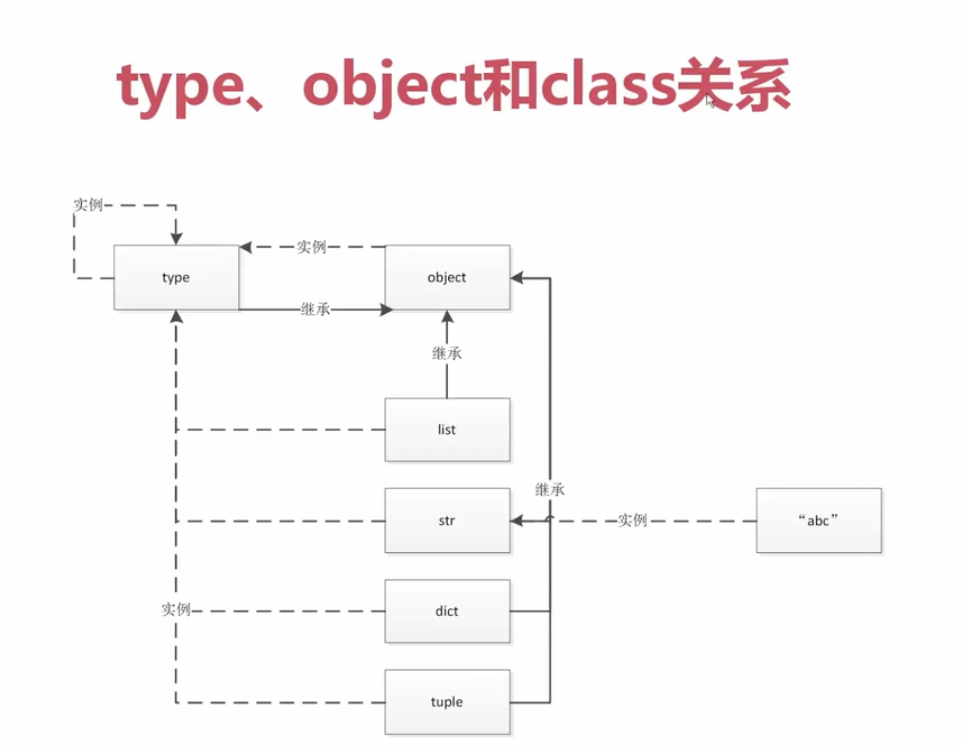

# type&class&object 
* type>init>1
* type>class->obj

<font color=FF0000 size=72>

## type&object 实例&继承
* type 生成class（类），type也是一个类，type基类是object
* object 最顶层基类，所有类继承object；基类为空
* object由type生成
</font>



```python
a=1
b="abc"
print(type(1))
print(type(int))
print(type(b))
print(type(str))

class Student:
    pass
stu = Student()
print(type(stu))
print(type(Student))
print(int.__bases__)
print(str.__bases__)
print(Student.__bases__)
print('type.__bases__', type.__bases__)
print('object.__bases__', object.__bases__)
print('type(object)', type(object))
```