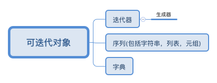

## 1. 魔法函数

```python
class Company(object):
    def __init__(self, employee_list):
        self.employee = employee_list

    def __getitem__(self, item):
         #item 为 0，1，2
        return self.employee[item]

    def __len__(self):
        return len(self.employee)

company = Company(["tom", "bob", "jane"])

for em in company:
    print(em)
```
>   * ##\_\_getitem\_\_原理
> 当不定义\_\_getitem\_\_时，for循环报错
> 一般如果想使用索引访问元素时，就可以在类中定义这个方法（__getitem__(self, key) ）。

> * ##Iterable & \_\_getitem\_\_ &  \_\_iter\_\_
>  Python中任意的对象，只要它定义了可以返回一个迭代器的__iter__方法，或者定义了可以支持下标索引的__getitem__方法，那么它就是一个可迭代对象

>  实现\_\_getitem\_\_ 则对象可迭代

>  调用优先级： \_\_iter\_\_>\_\_getitem\_\_ 

> \_\_getitem\_\_循环完成自动迭代

## 2. Iterable

* how do I determine if an object is iterable?
> https://stackoverflow.com/questions/1952464/in-python-how-do-i-determine-if-an-object-is-iterable#comment14861144_1952464
> https://stackoverflow.com/questions/9884132/what-exactly-are-iterator-iterable-and-iteration

2.1  Checking for \_\_iter\_\_ works on sequence types, but it would fail on e.g. strings in Python 2. I would like to know the right answer too, until then, here is one possibility (which would work on strings, too):

```text
try:
    some_object_iterator = iter(some_object)
except TypeError as te:
    print(some_object, 'is not iterable')
```
The iter built-in checks for the \_\_iter\_\_ method or in the case of strings the \_\_getitem\_\_ method.

2.2 Another general pythonic approach is to assume an iterable, then fail gracefully if it does not work on the given object. The Python glossary:

> Pythonic programming style that determines an object's type by inspection of its method or attribute signature rather than by explicit relationship to some type object ("If it looks like a duck and quacks like a duck, it must be a duck.") By emphasizing interfaces rather than specific types, well-designed code improves its flexibility by allowing polymorphic substitution. Duck-typing avoids tests using type() or isinstance(). Instead, it typically employs the EAFP (Easier to Ask \_\_getitem\_\_giveness than Permission) style of programming.


```python
try:
   _ = (e for e in my_object)
except TypeError:
   print my_object, 'is not iterable'
```
2.3 The collections module provides some abstract base classes, which allow to ask classes or instances if they provide particular functionality, for example:

```python
import collections

if isinstance(e, collections.Iterable):
    # e is iterable

```
## 3.  iterable && iterator
* An iterable is an object that has an __iter__ method which returns an iterator, or which defines a  __getitem__ method that can take sequential indexes starting from zero (and raises an IndexError when the indexes are no longer valid). So an iterable is an object that you can get an iterator from.

* An iterator is an object with a next (Python 2) or __next__ (Python 3) method.

* Whenever you use a for loop, or map, or a list comprehension, etc. in Python, the next method is called automatically to get each item from the iterator, thus going through the process of iteration.


* 凡是可作用于for循环的对象都是Iterable类型；

* 凡是可作用于next()函数的对象都是Iterator类型，它们表示一个惰性计算的序列；

* 集合数据类型如list、dict、str等是Iterable但不是Iterator，不过可以通过iter()函数获得一个Iterator对象。

Python的for循环本质上就是通过不断调用next()函数实现的

链接：https://www.zhihu.com/question/44015086/answer/119281039

Python中关于迭代有两个概念，第一个是Iterable，第二个是Iterator，协议规定Iterable的__iter__方法会返回一个Iterator, Iterator的__next__方法（Python 2里是next）会返回下一个迭代对象，如果迭代结束则抛出StopIteration异常。同时，Iterator自己也是一种Iterable，所以也需要实现Iterable的接口，也就是__iter__，这样在for当中两者都可以使用。Iterator的__iter__只需要返回自己就行了。这样，下面的代码就可以工作：
```python

for i in my_list:
    ...

for i in iter(mylist):
    ...

for i in (v for v in mylist if v is not None):
    ...
```

Python中许多方法直接返回iterator，比如itertools里面的izip等方法，如果Iterator自己不是Iterable的话，就很不方便，需要先返回一个Iterable对象，再让Iterable返回Iterator。生成器表达式也是一个iterator，显然对于生成器表达式直接使用for是非常重要的。那么为什么不只保留Iterator的接口而还需要设计Iterable呢？许多对象比如list、dict，是可以重复遍历的，甚至可以同时并发地进行遍历，通过__iter__每次返回一个独立的迭代器，就可以保证不同的迭代过程不会互相影响。而生成器表达式之类的结果往往是一次性的，不可以重复遍历，所以直接返回一个Iterator就好。让Iterator也实现Iterable的兼容就可以很灵活地选择返回哪一种。总结来说Iterator实现的__iter__是为了兼容Iterable的接口，从而让Iterator成为Iterable的一种实现。补充一下题主对于for的理解基本上是正确的，但仍然有一点点偏差：for为了兼容性其实有两种机制，如果对象有__iter__会使用迭代器，但是如果对象没有__iter__，但是实现了__getitem__，会改用下标迭代的方式。我们可以试一下：
```python
>>> class NotIterable(object):
...     def __init__(self, baselist):
...         self._baselist = baselist
...     def __getitem__(self, index):
...         return self._baselist[index]
...
>>> t = NotIterable([1,2,3])
>>> for i in t:
...     print i
...
1
2
3
>>> iter(t)
<iterator object at 0x0345E3D0>
```
当for发现没有__iter__但是有__getitem__的时候，会从0开始依次读取相应的下标，直到发生IndexError为止，这是一种旧的迭代协议。iter方法也会处理这种情况，在不存在__iter__的时候，返回一个下标迭代的iterator对象来代替。一个重要的例子是str，字符串就是没有__iter__接口的。

## 4 .for 自动迭代
Whenever you use a for loop, or map, or a list comprehension, etc. in Python, the next method is called automatically to get each item from the iterator, thus going through the process of iteration.


```python

import random

class DemoIterable(object):
    def __iter__(self):
        print('__iter__ called')
        return DemoIterator()

class DemoIterator(object):
    def __iter__(self):
        return self

    def __next__(self):
        print('__next__ called')
        r = random.randint(1, 10)
        if r == 5:
            print('raising StopIteration')
            raise StopIteration
        return r
#        return self.books.itervalues()

d = DemoIterator()
d1 = DemoIterable()
from collections.abc import Iterable,Iterator

print(isinstance(d, Iterable), isinstance(d, Iterator), isinstance(d1, Iterable), isinstance(d1, Iterator))


```