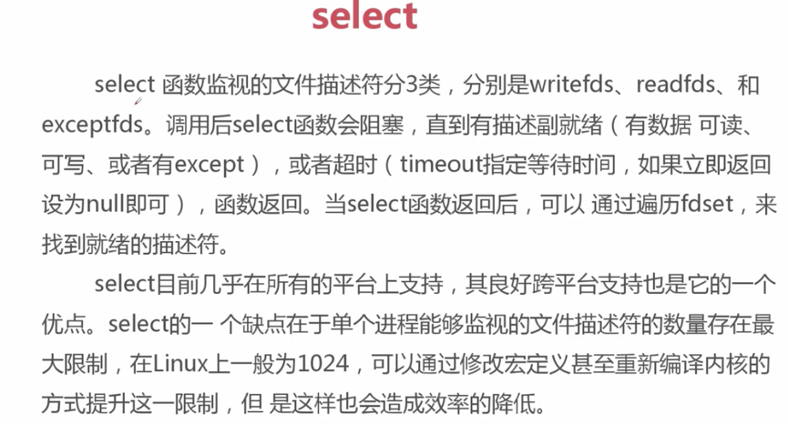

* [1. 并发，并行](#1)
    * [1.1 第二级1](#1.1)
    * [1.2 第二级2](#1.2)
* [2.同步，异步](#2)
* [3.阻塞，非阻塞](#3)

<h2 id="1">1. 并发，并行</h2>

* 并发是指一个时间段内，有几个程序在同一个cpu上运行，但是任意时刻只有一个程序在cpu上运行

* 并行是指任意时刻上，有多个程序同时运行在多个cpu上

<h2 id="2">2. 同步，异步</h2>
##### 消息之间通信机制

* 同步是指代码调用io操作时，必须等待io操作完成才返回的调用方式

* 异步是指代码调用io操作时，不必等io操作完成才返回的调用方式

<h2 id="3">3. 阻塞，非阻塞</h2>
##### 函数调用机制

* 阻塞： 调用函数时当前线程被挂起

* 非阻塞： 调用函数时当前线程不会被挂起，而是立即返回

C10k问题
<h2 id="4">4. unix下五种io模型</h2>

###unix下五种io模型：
* 阻塞式I/O

* 非阻塞I/O 
   
    * 不停的询问连接是否建立好， 需要while循环不停的去检查状态, 耗费cpu
    * 做计算任务或者再次发起其他的连接请求， 优势明显
    * 内核数据复制到用户空间时间

* I/O复用

   * select 监听多个sokect或文件句柄
   * 内核数据复制到用户空间时间
       

* 信号驱动式I/O【不常用】
* 异步I/O

### select&poll&epoll

#### select:

* 有描述符大小限制

#### poll

* 没有描述符大小限制

#### epoll

* 没有描述符大小限制

使用场景：
* 在并发高的情况下，连接活跃度不是很高， epoll比select
* 并发性不高，同时连接很活跃， select比epoll好
